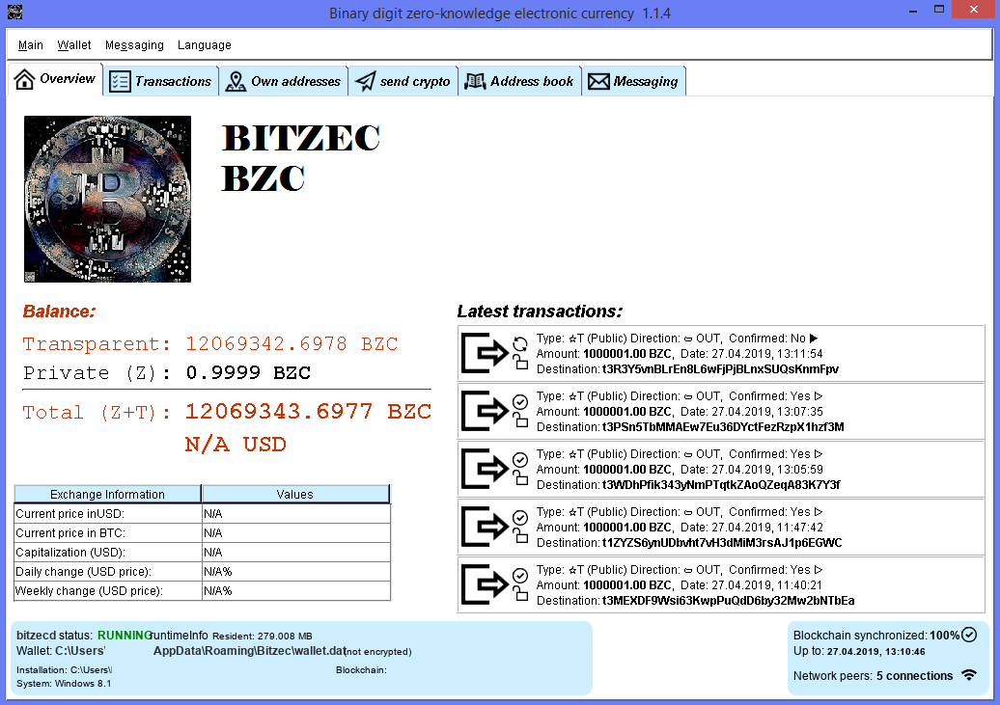

## [ZECmate Swing Wallet](https://swing.zecmate.com/) APT repository for Debian/Ubuntu Linux

## ATTENTION - ZECmate is NOT available via package repositry YET. Work in Progress. Please download signed .deb package directly from releases or from https://swing.zecmate.com

ZECmate Swing Wallet is also available via package repository for Debian/Ubuntu (and similar) Linux systems.



**This wallet is targeted at advanced users who understand the implications of running a full Zcash node on**
**the local machine, maintaining a full local copy of the blockchain, maintaining and backing up the**
**Zcash nodes's `wallet.dat` file etc! The wallet is not suitable for novice crypto-currency users!**

**SECURITY WARNING: Encryption of the wallet.dat file is not yet supported for Zcash. Using the wallet** 
**on a system infected with malware may result in wallet data/funds being stolen. The**
**wallet.dat needs to be backed up regularly (not just once - e.g. after every 30-40**
**outgoing transactions) and it must also be backed up after creating a new Z address.**

### Installing the ZECmate Swing Wallet on Linux
*Zcash is needed to be installed, follow https://z.cash/download.html prior to installing this ZECmate Swing wallet.*

To setup the APT repository and install packages, using a terminal run the following commands 
```
echo 'deb https://ZECmate.github.io/releases/ all main' | sudo tee --append /etc/apt/sources.list.d/ZECmate.list
gpg --keyserver keyserver.ubuntu.com --recv 69FAF6DE41B8AC51
gpg --export 69FAF6DE41B8AC51| sudo apt-key add -

sudo apt-get update
sudo apt-get install zecmate
```
   
### Running the ZECmate Swing Wallet on Linux

To launch the ZECmate Swing Wallet you can just search and click on it in the Ubuntu unity menu or alternatively, run the command `zecmate` from a terminal:
```
zecmate
```

### Disclaimer

THE SOFTWARE IS PROVIDED "AS IS", WITHOUT WARRANTY OF ANY KIND, EXPRESS OR
IMPLIED, INCLUDING BUT NOT LIMITED TO THE WARRANTIES OF MERCHANTABILITY,
FITNESS FOR A PARTICULAR PURPOSE AND NONINFRINGEMENT. IN NO EVENT SHALL THE
AUTHORS OR COPYRIGHT HOLDERS BE LIABLE FOR ANY CLAIM, DAMAGES OR OTHER
LIABILITY, WHETHER IN AN ACTION OF CONTRACT, TORT OR OTHERWISE, ARISING FROM,
OUT OF OR IN CONNECTION WITH THE SOFTWARE OR THE USE OR OTHER DEALINGS IN THE
SOFTWARE.

### Known issues and limitations
1. Limitation: if two users exchange text messages via the messaging UI TAB and one of them has a system clock, substantially running slow or fast by more than 1 minute, it is possible that this user will see text messages appearing out of order. 
1. Limitation: if a messaging identity has been created (happens on first click on the messaging UI tab), then replacing the `wallet.dat` or changing the node configuration between mainnet and testnet will make the identity invalid. This will result in a wallet update error. To remove the error the directory `~/.ZECmate/messaging` may be manually renamed or deleted (when the wallet is stopped). **CAUTION: all messaging history will be lost in this case!**
1. Limitation: Wallet encryption has been temporarily disabled in Zcash due to stability problems. A corresponding issue 
[#1552](https://github.com/zcash/zcash/issues/1552) has been opened by the Zcash developers. Correspondingly
wallet encryption has been temporarily disabled in the Zcash Desktop GUI Wallet.
1. Issue: GUI data tables (transactions/addresses etc.) allow copying of data via double click but also allow editing. 
The latter needs to be disabled. 
1. Limitation: The list of transactions does not show all outgoing ones (specifically outgoing Z address 
transactions). A corresponding issue [#1438](https://github.com/zcash/zcash/issues/1438) has been opened 
for the Zcash developers. 
1. Limitation: The CPU percentage shown to be taken by zcashd on Linux is the average for the entire lifetime 
of the process. This is not very useful. This will be improved in future versions.
